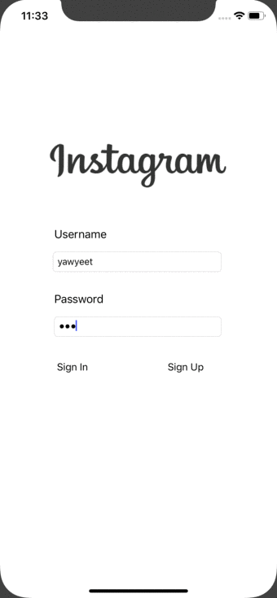
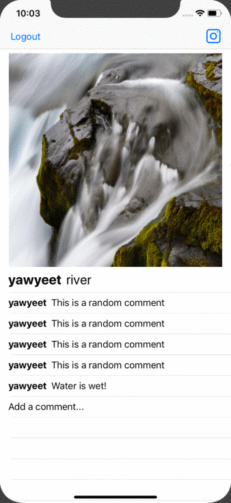

# Parstagram

*Instagram clone with a custom Parse backend that allows a user to post photos, view a global photo feed, and add comments!*

## Features

- Sign up, login, and logout capabilities added.
- User stays logged in across restarts. 
- User can view comments on a post. 
- User can add comments. 
- User sees app icon in home screen and styled launch screen. 
- User can take a photo, add a caption, and post it to the server. 
- User can view the last 20 posts. 

## Video Walkthrough
Here's a walkthrough of implemented features:
### Logging in and Posting:

### Commenting:

